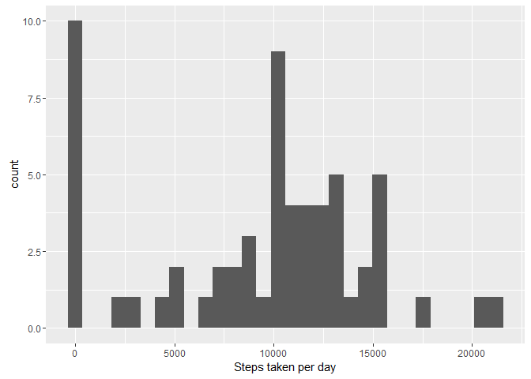
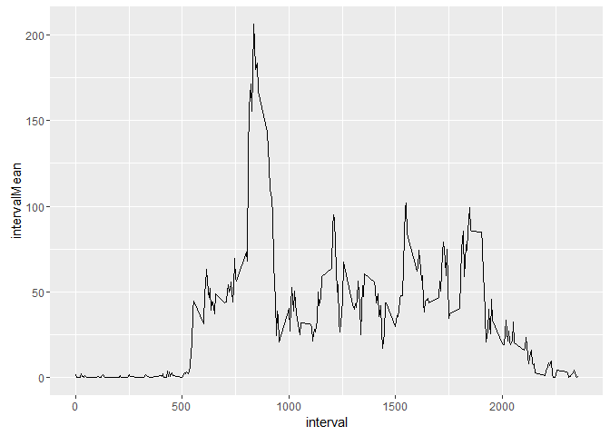
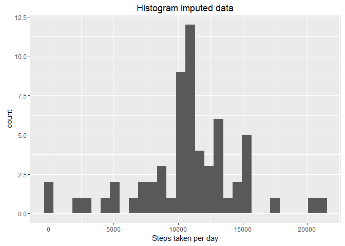
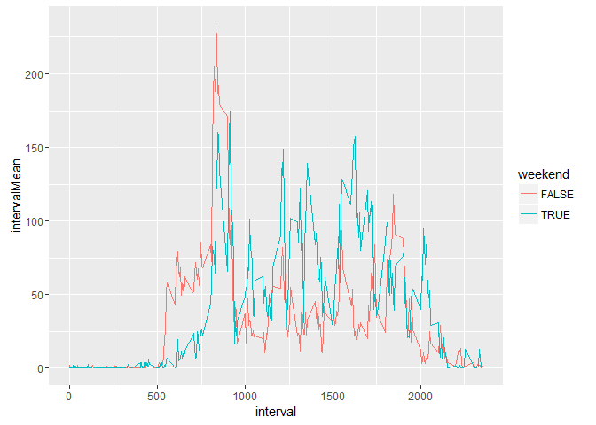

# Reproducible Research:  Peer Assessment 1

## Loading and preprocessing the data


```r
unzip("activity.zip", exdir = "raw_data")
activityData <- read.csv("raw_data/activity.csv", stringsAsFactors = FALSE)
```
Transforming columns.

```r
activityData$date <- as.Date(activityData$date)
library(data.table)
activityData <- as.data.table(activityData)
```


## What is mean total number of steps taken per day?
The sum of all steps taken, disregarding the NA's, is:

```r
sum(activityData$steps, na.rm = TRUE)
```

```
## [1] 570608
```


```r
stepsByDay <- activityData[, 
                           .(sumDate = sum(steps, na.rm = TRUE)), 
                           by = "date"]
library(ggplot2)
ggplot(data = stepsByDay) + 
  geom_histogram(aes(sumDate)) +
  labs(x = "Steps taken per day")
```

<!-- -->

The mean and median of steps taken each day are easily calculed using the new data table:

```r
mean(stepsByDay$sumDate)
```

```
## [1] 9354.23
```

```r
median(stepsByDay$sumDate)
```

```
## [1] 10395
```

## What is the average daily activity pattern?


```r
stepsByInterval <- activityData[, 
                           .(intervalMean = mean(steps, na.rm = TRUE)), 
                           by = "interval"]
ggplot(data = stepsByInterval) +
    geom_line(aes(interval, intervalMean))
```

<!-- -->
The interval with the largest average across all days is the following:

```r
stepsByInterval[intervalMean == max(stepsByInterval$intervalMean)]
```

```
##    interval intervalMean
## 1:      835     206.1698
```

## Imputing missing values
The total amount of NA's in the data set can be found in the summary:

```r
summary(activityData)
```

```
##      steps             date               interval     
##  Min.   :  0.00   Min.   :2012-10-01   Min.   :   0.0  
##  1st Qu.:  0.00   1st Qu.:2012-10-16   1st Qu.: 588.8  
##  Median :  0.00   Median :2012-10-31   Median :1177.5  
##  Mean   : 37.38   Mean   :2012-10-31   Mean   :1177.5  
##  3rd Qu.: 12.00   3rd Qu.:2012-11-15   3rd Qu.:1766.2  
##  Max.   :806.00   Max.   :2012-11-30   Max.   :2355.0  
##  NA's   :2304
```


```r
toImpute <- which(is.na(activityData$steps))
NAstepsIntervals <- activityData[toImpute]$interval
intervalMeans <- sapply(NAstepsIntervals, 
       function(x){
           stepsByInterval[interval == x]$intervalMean
           }
       )
activityDataImputed <- copy(activityData)
activityDataImputed[toImpute]$steps <- intervalMeans
```
The new histogram for the steps taken each day then changes to the following graph:

```r
stepsByDayImputed <- activityDataImputed[, 
                           .(sumDate = sum(steps, na.rm = TRUE)), 
                           by = "date"]
ggplot(data = stepsByDayImputed) + 
  geom_histogram(aes(sumDate)) +
  labs(x = "Steps taken per day", title = "Histogram imputed data")
```

<!-- -->
The new mean and median of steps taken each day are changed to the following:

```r
c(originalMean = mean(stepsByDay$sumDate),
imputedMean = mean(stepsByDayImputed$sumDate))
```

```
## originalMean  imputedMean 
##      9354.23     10749.77
```

```r
c(originalMedian = median(stepsByDay$sumDate),
imputedMedian = median(stepsByDayImputed$sumDate))
```

```
## originalMedian  imputedMedian 
##          10395          10641
```
Both mean and median have increased, meaning the missing data was mostly at very busy intervals with large average steps taken.  
The effect on the total steps taken is the following:

```r
c(originalSum = sum(activityData$steps, na.rm = TRUE),
imputedSum = sum(activityDataImputed$steps, na.rm = TRUE))
```

```
## originalSum  imputedSum 
##      570608      655736
```

```r
sum(activityDataImputed$steps, na.rm = TRUE) / sum(activityData$steps, na.rm = TRUE)
```

```
## [1] 1.149188
```
A 15% increase opposed to the original data!

## Are there differences in activity patterns between weekdays and weekends?


```r
weekendDays <- weekdays(as.Date(c("2016-08-27","2016-08-28")))
activityData[, weekend := weekdays(date) %in% weekendDays]
```
Then a histogram can be made that can distinguish between a weekday or weekend day:

```r
stepsByInterval <- activityData[, 
                           .(intervalMean = mean(steps, na.rm = TRUE)), 
                           by = c("weekend", "interval")]
ggplot(data = stepsByInterval) +
    geom_line(aes(interval, intervalMean, col = weekend))
```

<!-- -->
